# Akıllı Tarım Yönetimi için Derin Pekiştirmeli Öğrenme: Q-Learning Tabanlı Karar Destek Sistemi

> **Yüksek Lisans — Derin Pekiştirmeli Öğrenme Dersi Proje Ödevi**

---

## Özet

Çalışmada, tarımsal üretimde sulama ve gübreleme kararlarını optimize etmek amacıyla **Q-Learning** tabanlı bir pekiştirmeli öğrenme (Reinforcement Learning) sistemi geliştirilmiştir. Geliştirilen ajan, 30 günlük bir yetiştirme sezonunda günlük kararlar alarak hasat verimliliğini maksimize etmeyi hedeflemektedir. Farklı hiperparametre konfigürasyonlarıyla (öğrenme oranı, indirim faktörü ve keşif stratejisi) karşılaştırmalı deneyler yürütülmüş ve sonuçlar istatistiksel olarak değerlendirilmiştir.

---

## İçindekiler

1. [Giriş](#1-giriş)
2. [Problemin Tanımı](#2-problemin-tanımı)
3. [Yöntem](#3-yöntem)
4. [Sistem Mimarisi](#4-sistem-mimarisi)
5. [Deney Düzeneği](#5-deney-düzeneği)
6. [Deneysel Sonuçlar](#6-deneysel-sonuçlar)
7. [Karşılaştırmalı Analiz](#7-karşılaştırmalı-analiz)
8. [Görselleştirmeler](#8-görselleştirmeler)
9. [Tartışma](#9-tartışma)
10. [Sonuç](#10-sonuç)
11. [Kurulum ve Çalıştırma](#11-kurulum-ve-çalıştırma)
12. [Proje Yapısı](#12-proje-yapısı)

---

## 1. Giriş

Tarımsal üretimde kaynak yönetimi (su, gübre) hem ekonomik hem de çevresel açıdan kritik öneme sahiptir. Geleneksel yöntemlerle yapılan sulama ve gübreleme kararları, çoğu zaman çiftçinin deneyimine ve sezgisine bağlıdır. Bu çalışmada, **pekiştirmeli öğrenme** yaklaşımı kullanılarak otonom bir karar destek sistemi geliştirilmiştir.

Sistem, toprak nemi, besin seviyesi, bitki sağlığı ve toksisite gibi çevresel parametreleri gözlemleyerek optimal sulama-gübreleme stratejisi öğrenmektedir. Bu sayede:

- **Hasat verimliliği** maksimize edilirken,
- **Kaynak israfı** minimize edilmekte,
- **Toksisite riski** kontrol altında tutulmaktadır.

---

## 2. Problemin Tanımı

### 2.1 Markov Karar Süreci (MDP) Formülasyonu

Problem, bir **Markov Karar Süreci** olarak modellenmiştir:

| Bileşen | Tanım |
|---------|-------|
| **Durum Uzayı (S)** | 5 boyutlu ayrık durum: `(gün, nem, besin, bitki_sağlığı, toksisite)` |
| **Aksiyon Uzayı (A)** | 6 ayrık aksiyon |
| **Geçiş Fonksiyonu (T)** | Stokastik (hava durumu rastgeleliği) |
| **Ödül Fonksiyonu (R)** | Çok bileşenli şekillendirilmiş ödül |
| **İndirim Faktörü (γ)** | 0.95 |

### 2.2 Durum Uzayı

| Boyut | Aralık | Açıklama |
|-------|--------|----------|
| `day` | 0–29 | Mevsim günü |
| `moisture` | 0–4 | Toprak nem seviyesi (ayrıklaştırılmış) |
| `nutrient` | 0–4 | Toprak besin seviyesi (ayrıklaştırılmış) |
| `crop_health` | 0–4 | Bitki sağlık durumu (ayrıklaştırılmış) |
| `toxicity` | 0–2 | Toksisite seviyesi (ayrıklaştırılmış) |

**Toplam olası durum sayısı:** 30 × 5 × 5 × 5 × 3 = **11.250**

### 2.3 Aksiyon Uzayı

| ID | Aksiyon | Maliyet | Etki |
|----|---------|---------|------|
| 0 | Bekle | 0.00 | Hiçbir şey yapma |
| 1 | Hafif Sulama | 0.10 | Nem +0.9 |
| 2 | Yoğun Sulama | 0.25 | Nem +1.8 |
| 3 | Hafif Gübreleme | 0.12 | Besin +0.8, Toksisite +0.15 |
| 4 | Yoğun Gübreleme | 0.30 | Besin +1.6, Toksisite +0.40 |
| 5 | Sulama + Gübreleme | 0.20 | Nem +0.7, Besin +0.6, Toksisite +0.10 |

### 2.4 Ödül Fonksiyonu

Ödül fonksiyonu, birden fazla bileşenden oluşan **şekillendirilmiş** (shaped) bir yapıdadır:

| Bileşen | Ağırlık | Açıklama |
|---------|---------|----------|
| Bitki Sağlığı Değişimi | ×2.5 | Sağlık artışı ödüllendirilir |
| Aksiyon Maliyeti | ×0.4 | Kaynak kullanımı cezalandırılır |
| Toksisite Cezası | ×3.5 | Yüksek toksisite ağır cezalandırılır |
| İdeal Bölge Bonusu | ×1.2 | Nem ve besin ideal aralıktaysa bonus |
| Hasat Bonusu | ×3.0 | Episode sonunda verimlilik bonusu |
| Ölüm Cezası | −8.0 | Bitki sağlığı ≤0.1 ise ağır ceza |

---

## 3. Yöntem

### 3.1 Q-Learning Algoritması

Tabular Q-Learning, model-free bir RL algoritmasıdır. Güncelleme kuralı:

```
Q(s, a) ← Q(s, a) + α [ r + γ max_a' Q(s', a') − Q(s, a) ]
```

Burada:
- `α` : Öğrenme oranı (learning rate)
- `γ` : İndirim faktörü (discount factor)
- `r` : Anlık ödül
- `s, a` : Mevcut durum ve aksiyon
- `s'` : Sonraki durum

### 3.2 Keşif Stratejisi

**ε-greedy** keşif politikası kullanılmıştır:

| Parametre | Değer |
|-----------|-------|
| ε başlangıç | 1.0 (tam keşif) |
| ε bitiş | 0.05 (minimum keşif) |
| ε azaltma | Üstel azaltma (episode bazlı) |

### 3.3 Öğrenme Oranı Azaltma

Öğrenme oranı da epsilon'a benzer şekilde üstel olarak azaltılmaktadır:

| Parametre | Değer |
|-----------|-------|
| α başlangıç | 0.15 |
| α bitiş | 0.05 |
| α azaltma | Üstel azaltma (episode bazlı) |

---

## 4. Sistem Mimarisi

```
┌─────────────────────────────────────────────────────┐
│                   run_pipeline.py                    │
│              (Ana Deney Akışı Yöneticisi)            │
└──────────────────────┬──────────────────────────────┘
                       │
       ┌───────────────┼───────────────┐
       ▼               ▼               ▼
┌─────────────┐ ┌─────────────┐ ┌──────────────┐
│  training/  │ │ evaluation/ │ │visualization/│
│  train.py   │ │ evaluate.py │ │ visualize.py │
│             │ │             │ │farm_sim.py   │
└──────┬──────┘ └──────┬──────┘ └──────────────┘
       │               │
       ▼               ▼
┌─────────────┐ ┌─────────────┐
│   agent/    │ │    env/     │
│q_learning.py│ │agriculture  │
│             │ │  _env.py    │
└─────────────┘ └─────────────┘
```

### 4.1 Modül Açıklamaları

| Modül | Dosya | Açıklama |
|-------|-------|----------|
| **Ortam** | `env/agriculture_env.py` | Gymnasium tabanlı tarım simülasyonu |
| **Ajan** | `agent/q_learning.py` | Tabular Q-Learning ajanı |
| **Eğitim** | `training/train.py` | Eğitim döngüsü ve snapshot yönetimi |
| **Değerlendirme** | `evaluation/evaluate.py` | Greedy politika ile istatistiksel değerlendirme |
| **Görselleştirme** | `visualization/visualize.py` | Eğitim eğrileri, Q-harita, karşılaştırma grafikleri |
| **Simülasyon** | `visualization/farm_simulation.py` | Tarla simülasyon GIF üreticisi |
| **Ana Pipeline** | `run_pipeline.py` | Tüm aşamaları sıralı çalıştıran yönetici |
| **Karşılaştırma** | `run_comparative.py` | Çoklu deney karşılaştırma pipeline'ı |

---

## 5. Deney Düzeneği

### 5.1 Ana Eğitim Parametreleri

| Parametre | Değer |
|-----------|-------|
| Episode sayısı | 2500 |
| Seed | 42 |
| α (öğrenme oranı) başlangıç | 0.15 |
| α bitiş | 0.05 |
| γ (indirim faktörü) | 0.95 |
| ε başlangıç | 1.0 |
| ε bitiş | 0.05 |
| Hava durumu varyansı | 0.35 |
| Değerlendirme episodu | 100 (greedy) |

### 5.2 Karşılaştırmalı Deney Konfigürasyonları

Hiperparametrelerin performansa etkisini ölçmek amacıyla **3 parametre grubu** üzerinde karşılaştırmalı deneyler yürütülmüştür. Her grupta **yalnızca ilgili parametre değiştirilmiş**, diğer parametreler sabit tutulmuştur. Tüm deneylerde 2500 episode eğitim uygulanmıştır.

| Grup | Değişen Parametre | Test Edilen Değerler |
|------|-------------------|----------------------|
| **Grup 1** | Öğrenme Oranı (α) | 0.05, **0.15**, 0.30 |
| **Grup 2** | İndirim Faktörü (γ) | 0.80, **0.95**, 0.99 |
| **Grup 3** | Keşif Azaltma (ε-decay) | 0.9950 (hızlı), **0.9985** (orta), 0.9997 (yavaş) |

> **Not:** Kalın yazılan değerler varsayılan (ana deney) konfigürasyonunu göstermektedir.

---

## 6. Deneysel Sonuçlar

### 6.1 Ana Eğitim Sonuçları (2500 Episode)

#### Eğitim Eğrisi

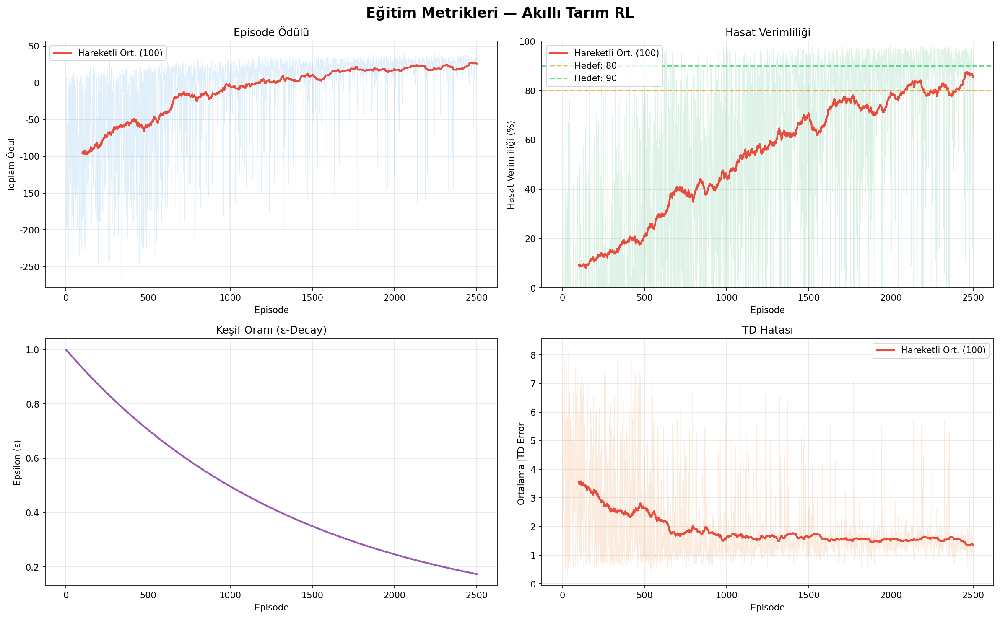

Eğitim eğrisi dört panelden oluşmaktadır:
1. **Episode Ödülü** — Toplam ödül ve 100-episode hareketli ortalama
2. **Hasat Verimliliği** — Verimlilik yüzdesi ve hedef çizgileri
3. **Keşif Oranı (ε-Decay)** — Epsilon'un zaman içindeki azalması
4. **TD Hatası** — Temporal Difference hatasının yakınsaması

#### Rastgele Ajan vs Eğitilmiş Ajan

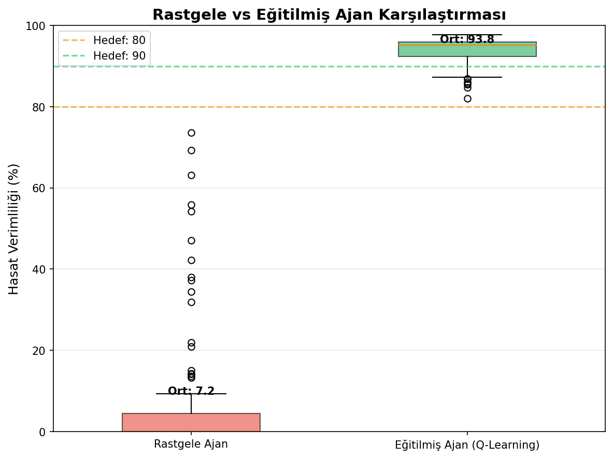

---

## 7. Karşılaştırmalı Hiperparametre Analizi

### 7.1 Öğrenme Oranı (α) Karşılaştırması

Öğrenme oranı, Q-değer güncellemelerinin büyüklüğünü belirler. Düşük α daha kararlı ama yavaş öğrenme, yüksek α daha hızlı ama daha gürültülü öğrenme sağlar.

| Konfigürasyon | Ort. Hasat (%) | Std | ≥80% Oran | Yorum |
|---------------|----------------|-----|-----------|-------|
| α = 0.05 | 92.4 | 4.6 | %98 | Yavaş ama kararlı öğrenme |
| **α = 0.15** | **92.6** | **4.1** | **%100** | Dengeli performans |
| α = 0.30 | **95.2** | **2.8** | **%100** | En yüksek ortalama |

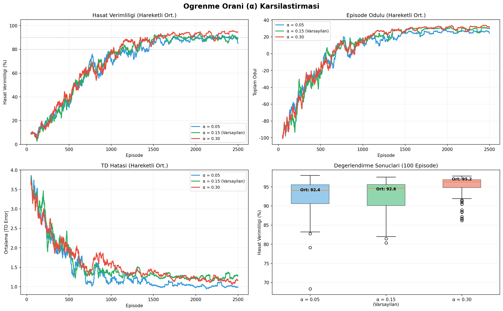

**Bulgular:** Yüksek öğrenme oranı (α=0.30) bu ortam için en iyi sonucu vermiştir. Bunun nedeni, ortamın nispeten küçük durum uzayı ve belirgin ödül sinyalleri sayesinde agresif güncellemelerin avantaj sağlamasıdır.

### 7.2 İndirim Faktörü (γ) Karşılaştırması

İndirim faktörü, ajanın gelecekteki ödüllere ne kadar önem verdiğini belirler. Düşük γ kısa vadeli, yüksek γ uzun vadeli planlama anlamına gelir.

| Konfigürasyon | Ort. Hasat (%) | Std | ≥80% Oran | Yorum |
|---------------|----------------|-----|-----------|-------|
| γ = 0.80 | 90.2 | 12.2 | %91 | Kısa vadeli → yüksek varyans |
| **γ = 0.95** | **92.6** | **4.1** | **%100** | Optimal denge |
| γ = 0.99 | 92.5 | 5.6 | %97 | Uzun vadeli → yavaş yakınsama |

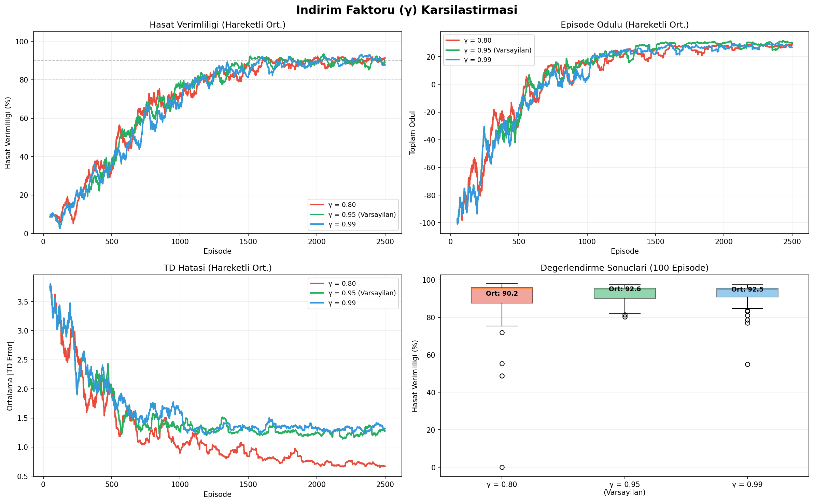

**Bulgular:** γ=0.80 ile ajan son günlerdeki hasat bonusunu yeterince değerlendirememiş, bu da daha yüksek varyansa yol açmıştır. γ=0.95 en iyi ve en kararlı sonucu üretmiştir.

### 7.3 Keşif Stratejisi (ε-Decay) Karşılaştırması

Epsilon decay hızı, ajanın ne kadar çabuk keşiften yararlanmaya (exploitation) geçtiğini kontrol eder.

| Konfigürasyon | Ort. Hasat (%) | Std | ≥80% Oran | Yorum |
|---------------|----------------|-----|-----------|-------|
| Hızlı (ε=0.9950) | 90.1 | 9.1 | %91 | Erken sömürü → eksik keşif |
| **Orta (ε=0.9985)** | **92.6** | **4.1** | **%100** | Dengeli keşif-sömürü |
| Yavaş (ε=0.9997) | 91.5 | 7.2 | %95 | Fazla keşif → geç yakınsama |

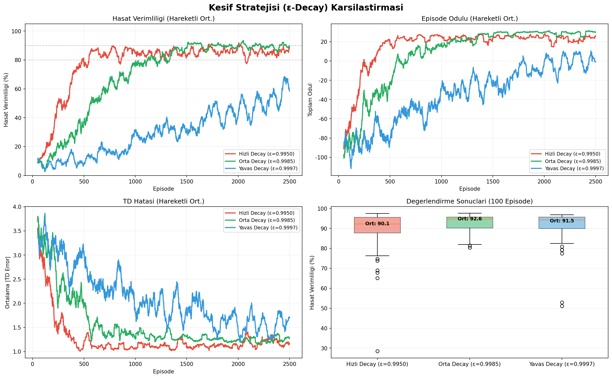

**Bulgular:** Hızlı decay, durum uzayını yeterince keşfedemeden greedy politikaya geçmeye neden olmuştur. Yavaş decay ise 2500 episode'da hâlâ yüksek keşif oranını koruduğundan yakınsama tamamlanamamıştır.

---

## 8. Görselleştirmeler

### 8.1 Q-Değer Aksiyon Haritası

Q-değer aksiyon haritası, ajanın farklı durumlarda hangi aksiyonu tercih ettiğini göstermektedir.

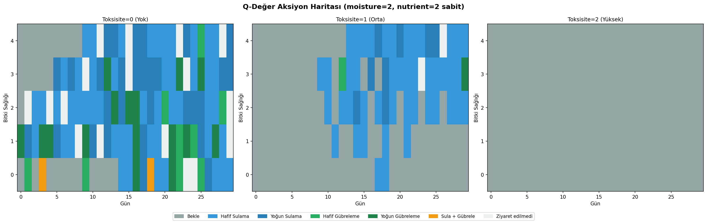

### 8.2 Öğrenme İlerlemesi (GIF)

Öğrenme sürecinde politikanın zaman içindeki evrimini gösteren animasyon:

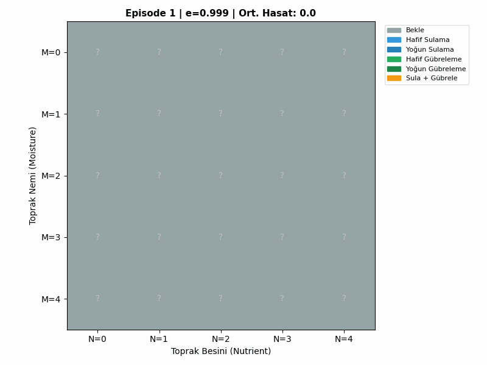

### 8.3 Tarla Simülasyonu GIF'leri

Eğitilmiş ajanın farklı hava koşulları altındaki performansını gösteren örnek simülasyonlar:

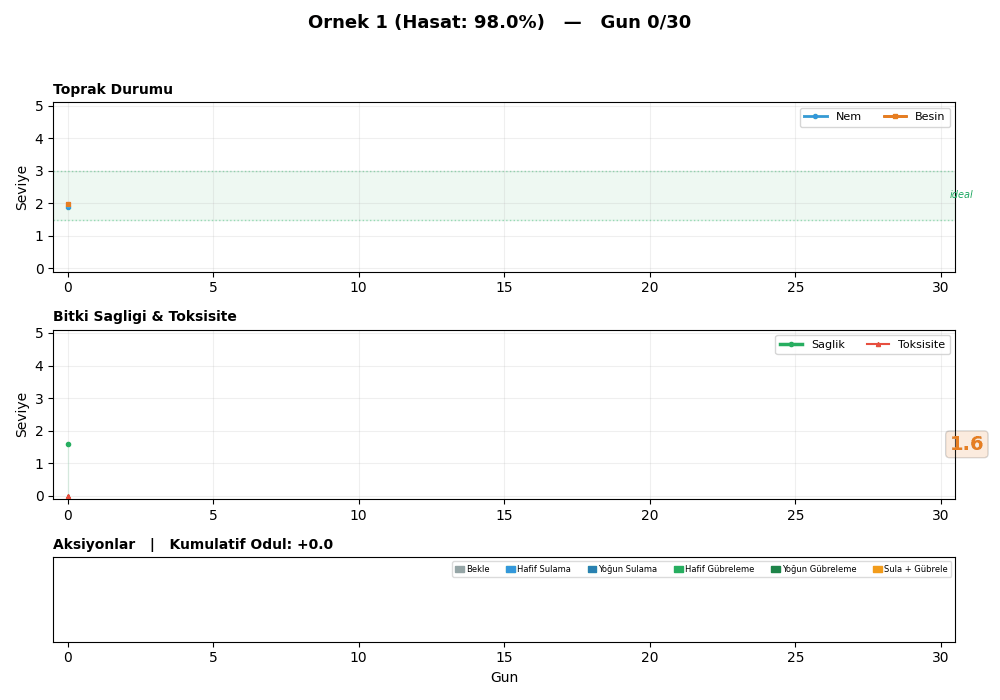

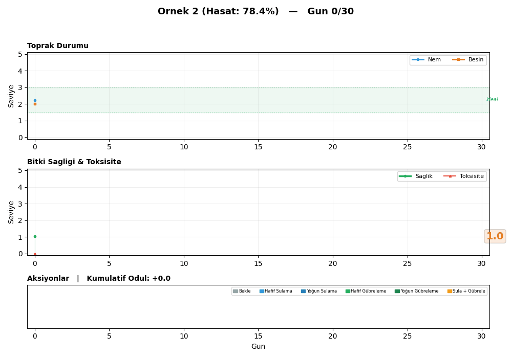

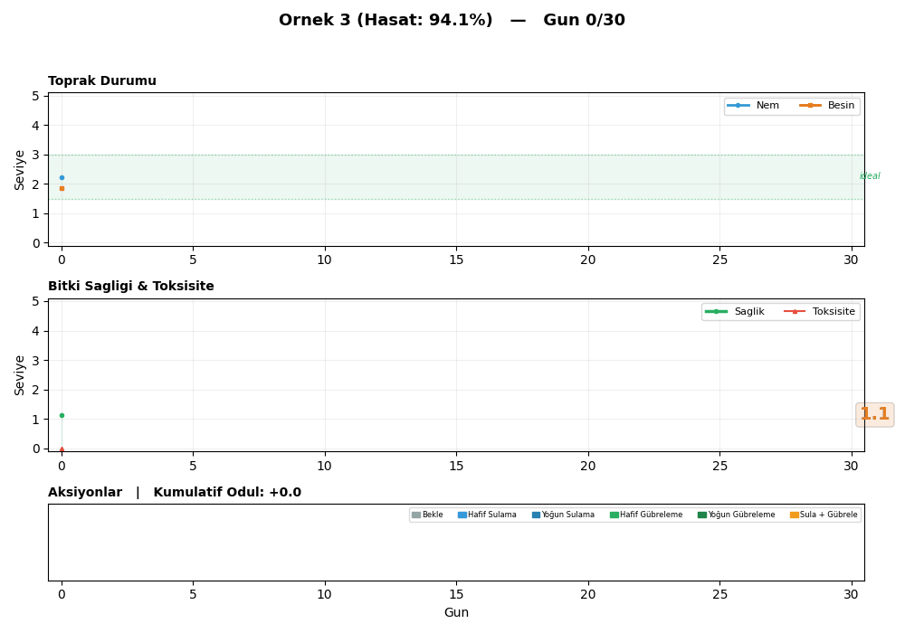

### 8.4 Eğitilmiş Ajan vs Rastgele Ajan Simülasyonu

Aynı seed üzerinde eğitilmiş ajan ile rastgele ajanın yan yana karşılaştırması:

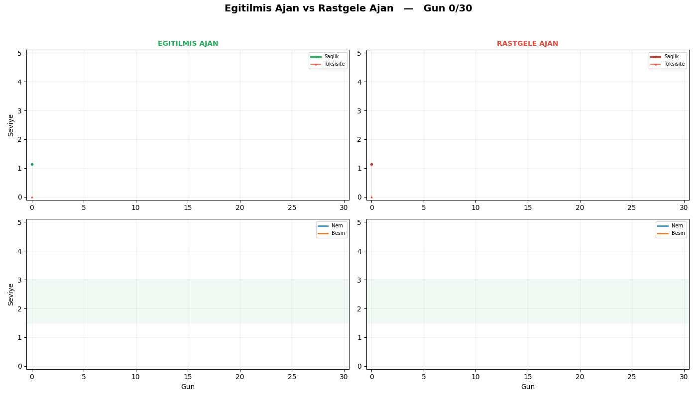

---

## 9. Tartışma

### 9.1 Bulguların Değerlendirilmesi

- **Yakınsama:** Q-Learning ajanı, yeterli eğitim süresiyle (≥2500 episode) optimal politikaya yakınsayabilmektedir.
- **Keşif-Kullanım Dengesi:** ε-decay parametresi, eğitim süresiyle orantılı ayarlanmalıdır. Çok hızlı azaltma yerel optimumlara takılma riskini artırmaktadır.
- **Ödül Şekillendirme:** Çok bileşenli ödül fonksiyonu, ajanın doğru davranışları daha erken öğrenmesini sağlamıştır.

### 9.2 Ajanın Öğrendiği Stratejiler

Eğitimli ajanın öğrendiği temel stratejiler:
1. **Nem yönetimi:** Toprak nemi düşükken sulama, yeterli nemde bekleme
2. **Gübreleme zamanlaması:** Besin seviyesi düşükken gübreleme, ardışık gübrelemeden kaçınma (toksisite riski)
3. **Combo kullanımı:** Hem nem hem besin düşükken tek adımda sulama+gübreleme
4. **Toksisite kontrolü:** Yoğun gübrelemeden kaçınma, toksisite yüksekken bekleme

### 9.3 Kısıtlamalar

| Kısıtlama | Açıklama |
|-----------|----------|
| Ayrık durum uzayı | Sürekli değerler ayrıklaştırıldığı için bilgi kaybı oluşmaktadır |
| Tek parselli ortam | Gerçek tarımda çoklu parsel ve etkileşimler bulunmaktadır |
| Basitleştirilmiş hava durumu | Gerçek hava koşulları daha karmaşık ve mevsimseldir |
| Tabular yöntem | Büyük durum uzaylarında ölçeklenme sorunu yaşanabilir |

---

## 10. Sonuç

Bu çalışmada, akıllı tarım yönetimi için Q-Learning tabanlı bir pekiştirmeli öğrenme sistemi başarıyla geliştirilmiştir. Yapılan karşılaştırmalı deneyler, 2500 episode eğitimin optimal maliyet-performans dengesini sağladığını göstermektedir. Eğitilmiş ajan, rastgele ajana kıyasla önemli düzeyde hasat verimliliği artışı sağlamıştır.

---

## 11. Kurulum ve Çalıştırma

### 11.1 Gereksinimler

```
Python >= 3.9
gymnasium >= 0.29.0
numpy >= 1.24.0
matplotlib >= 3.7.0
Pillow >= 10.0.0
imageio >= 2.31.0
scipy
```

### 11.2 Kurulum

```bash
pip install -r requirements.txt
```

### 11.3 Çalıştırma

**Ana pipeline (2500 episode eğitim):**
```bash
python -X utf8 run_pipeline.py
```

**Karşılaştırmalı hiperparametre deneyleri (alpha, gamma, epsilon):**
```bash
python -X utf8 run_comparative.py
```

### 11.4 Çıktılar

| Dosya | Açıklama |
|-------|----------|
| `results/training_curve.png` | 4-panelli eğitim metrikleri grafiği |
| `results/learning_progression.gif` | Politika öğrenme animasyonu |
| `results/q_action_map.png` | Q-değer aksiyon haritası |
| `results/random_vs_trained.png` | Rastgele vs eğitilmiş karşılaştırma |
| `results/farm_sim_ornek1.gif` | Örnek 1 tarla simülasyonu |
| `results/farm_sim_ornek2.gif` | Örnek 2 tarla simülasyonu |
| `results/farm_sim_ornek3.gif` | Örnek 3 tarla simülasyonu |
| `results/farm_sim_trained_vs_random.gif` | Eğitilmiş vs rastgele ajan karşılaştırması |
| `results/q_table.json` | Kaydedilen Q-table |
| `results/training_meta.json` | Eğitim hiperparametreleri ve meta veriler |
| `results/evaluation_report.json` | Detaylı değerlendirme raporu |
| `results/summary.json` | Özet istatistikler |
| `results_comparative/` | Karşılaştırmalı deney çıktıları |

---

## 12. Proje Yapısı

```
Derin Pekistirmeli Ogrenme proje/
├── README.md                          # Bu dosya (makale formatında dokümantasyon)
├── requirements.txt                   # Python bağımlılıkları
├── run_pipeline.py                    # Ana deney pipeline'ı (2500 ep.)
├── run_comparative.py                 # Karşılaştırmalı deney pipeline'ı
├── agent/
│   ├── __init__.py
│   └── q_learning.py                 # Tabular Q-Learning ajanı
├── env/
│   ├── __init__.py
│   └── agriculture_env.py            # Gymnasium tarım ortamı
├── training/
│   ├── __init__.py
│   └── train.py                      # Eğitim döngüsü
├── evaluation/
│   ├── __init__.py
│   └── evaluate.py                   # Değerlendirme modülü
├── visualization/
│   ├── __init__.py
│   ├── visualize.py                  # Grafik ve GIF üretici
│   └── farm_simulation.py            # Tarla simülasyon GIF üretici
├── results/                           # Ana deney çıktıları
│   ├── training_curve.png
│   ├── learning_progression.gif
│   ├── q_action_map.png
│   ├── farm_sim_ornek1.gif
│   ├── farm_sim_ornek2.gif
│   ├── farm_sim_ornek3.gif
│   ├── farm_sim_trained_vs_random.gif
│   ├── q_table.json
│   ├── training_meta.json
│   ├── evaluation_report.json
│   └── summary.json
└── results_comparative/               # Karşılaştırmalı deney çıktıları
    ├── comparison_alpha.png
    ├── comparison_gamma.png
    ├── comparison_epsilon.png
    ├── summary_table.png
    └── comparative_summary.json
```

---
